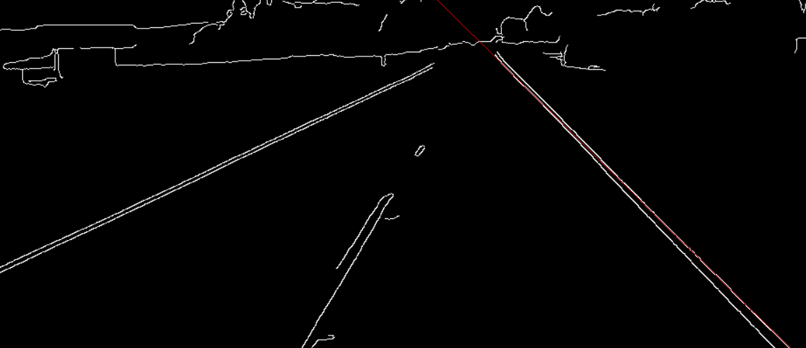

# Custom RANSAC For Line Detection on a given image v.1.0

The [RANSAC](https://en.wikipedia.org/wiki/Random_sample_consensus) **(RANdom SAmple Consensus)** is algorithm that estimates parameters 
of a model by random sampling of observer data. Given the dataset whose data elements
contains both ouliers and inliers, RANSAC uses the voting scheme to find optimal result.

Pros:
- Easy to use 

Cons:
* Sometimes are not optimal
* Slow algorithm

This repository contains custom implementation of RANSAC algorithm only for line
detection on the given image.

The output of the RANSAC is recognized line items on the image:

